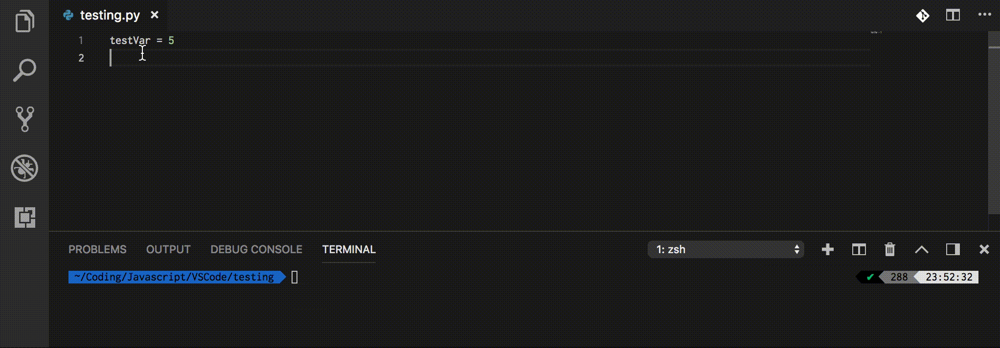

# Python Quick Logger

A fork of [Python Quick Print](https://marketplace.visualstudio.com/items?itemName=AhadCove.python-quick-print) that uses standard library Logging instances instead of print.

Highlight a variable `foo` you would like to log, enter keyboard `cmd + shift + l`, and on the line below variable, it wrap `foo` as follows:
```
import logging

log = logging.getlogger(__name__)

foo = ["a", "b", "c"]
log.info(f'foo {type(foo)}: {foo}')

----

$ foo <class 'list'>: ["a", "b", "c"]
```

I did not update this gif, this shows Python Quick Print. You get the idea...


## Installing

This extension is available for free in the [Visual Studio Code Marketplace](https://marketplace.visualstudio.com/items?itemName=brian-crant.python-logger-vscode)

## How to use

#### Only activates with .py files

* Highlight anything in the editor
* Press `Cmd+Shift+L` (Mac), or `Ctrl+Shift+L` (Windows)
* 
* The output (on a new line) will be: `log.info(f'variable: {variable}')`

#### Keyboard Shortcut
By default the keyboard shortcut is `Cmd+Shift+L` or `Ctrl+Shift+L`
If this shortcut interferes with another extension or system wide Shortcut, you may change it in the `Keyboard Shortcuts Setting`.

Press `Cmd+P` or `Ctrl+P` and type in `Open Keyboard Shortcuts`.
Search for `Print Python Selection` and click on the `pen icon`.
This is where you can enter any `Shortcut` you choose.

## License
[MIT License](LICENSE)
